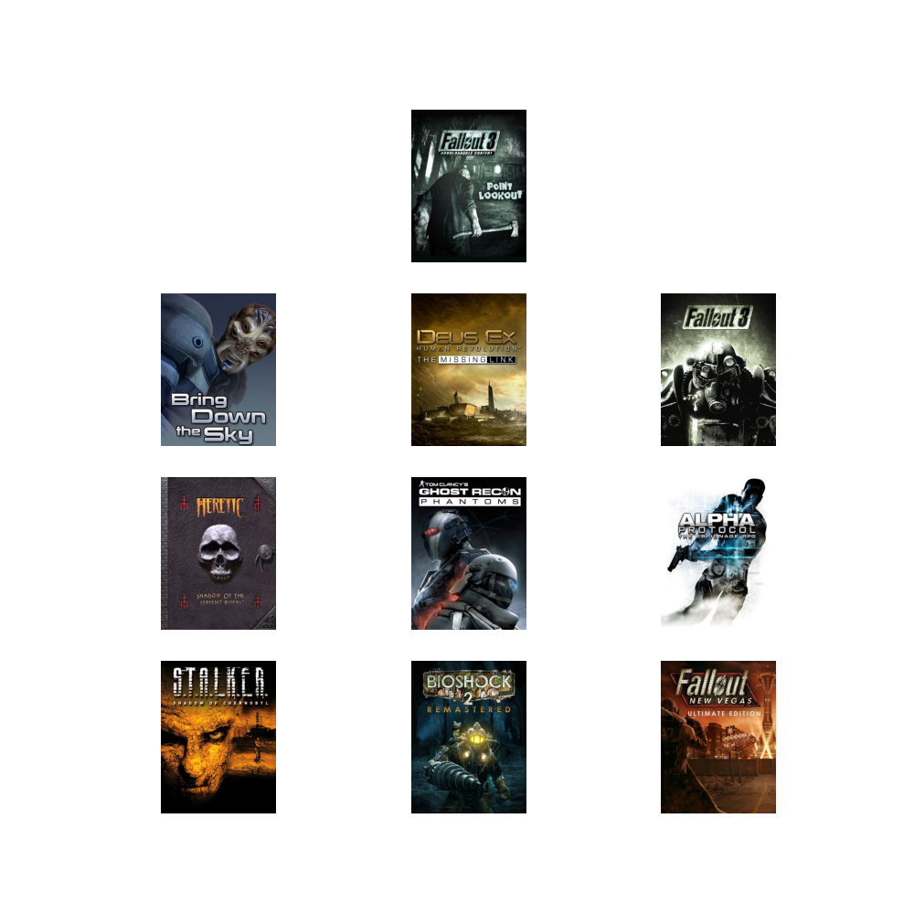
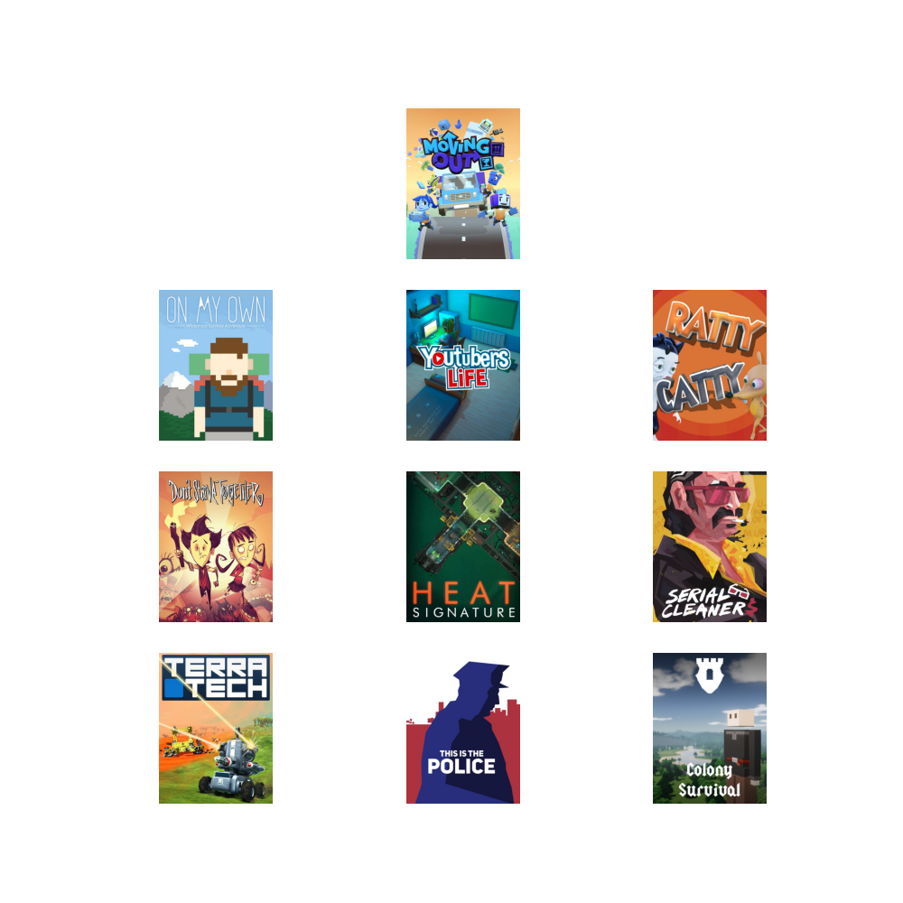
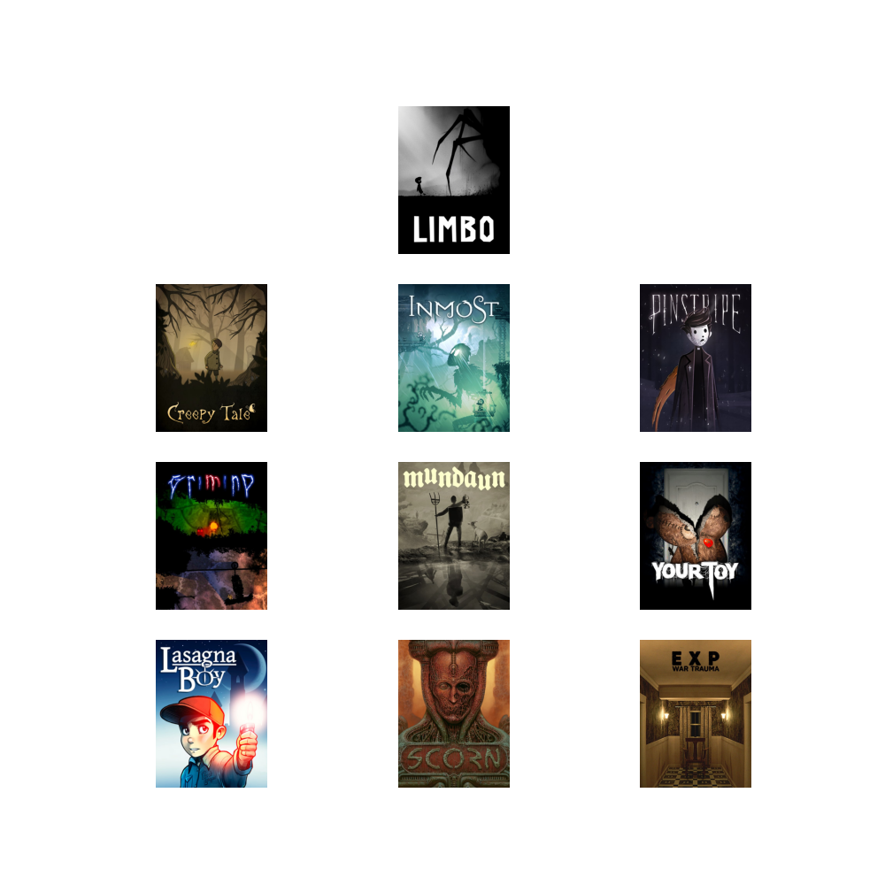

# MultiMediaSearch

A multimodal search engine for video games using several transformers and a custom multi-domain CLIP model.

### Custom Text Search


*Search : Mythological strategy game*

### Similar Game Search



*Search : Fallout 3: Point Lookout*



*Search : Moving Out*



*Search : Limbo*


### Installation

- Create a virtual environment python3.8+

##### Install pytorch

- `python3 -m pip install torch==1.10.2+cu113 torchvision==0.11.3+cu113 torchaudio===0.10.2+cu113 -f https://download.pytorch.org/whl/torch_stable.html`

##### Install requirements

- `python3 -m pip install -r requirements.txt`
- Optional but required for serving. ```python3 setup.py install```


##### Preparation of GameGator Dataset
Please take a look at the [docs/GameGatorService.md](docs/GameGatorService.md) for the preparation of the dataset.

##### Training

- Create a copy of multimedia_search/semantic_search_engine/configs/config.yaml and set the dataset path.
- Adjust the other parameters and leave video encoder disabled unless you have video data!
- You can generate mock-up video data using the script `multimedia_search/utility/mock.py`
- Run `python3 train.py --config_path <path to config.yaml>`
- or `python3 train_md_clip.py --config_path <path to config.yaml>` to train the model using pytorch lightning.

##### Testing clip-like multimodel solution with string query

- Run `python3 test.py -conf custom_configs/config_v1.yaml -mp trained_models/best.pt -so text -st "gloomy war game"`
-

##### Testing sentence-transformer based solution with string query

- Run `python3 test_sentence_transformer.py -conf custom_configs/config_sentence_v1.yaml -q "gloomy war game"`

##### Testing clip-like multimodel solution with random game query

- This output similar games to the query game. Check the folder `pairwise_search_results` for the results
- Run `python3 test.py -conf custom_configs/config_v1.yaml -mp trained_models/best.pt -so pairwise`

### Services

Currently, GameGatorEngine supports 3 services. Please take a look at the [docs/GameGatorService.md](docs/GameGatorService.md) for the details.

#### Build a torchserve service

- ```python3 setup.py install```
- ```cd service/```
- ```python3 start_torchserve_[SERVICE_NAME].py```
    - ```Example : python3 start_torchserve_multimodel.py```

##### Testing with torchserve services

- ```cd service/```

Text

- ```python3 request_torchserve.py --search_option text --search_text "gloomy war game" --endpoint gamegator-multi-search --dataset_path PATH_TO_DATASET```

Image

- ```python3 request_torchserve.py --search_option game --game_id 10 --endpoint gamegator-multi-search --dataset_path PATH_TO_DATASET```

Similar Game

- ```python3 request_torchserve.py --search_option image --image_path PATH_TO_IMAGE --endpoint gamegator-multi-search --dataset_path PATH_TO_DATASET```

New Game Registry

- ```python3 request_torchserve.py --search_option new_game --game_id 10 --endpoint gamegator-multi-search --dataset_path PATH_TO_DATASET```

##### Stop torchserve

- ```torchserve --stop```
- If you want to remove the previously registered
  model ```rm -rf logs model_store_multi | model_store_mm | model_store_ss```

##### Utility

Folder : `multimedia_search/utility/`
- Download trailer videos per game ```python3 get_youtube_videos.py --dataset_path [PATH_TO_DATASET]```
    - This is using multiprocessing intensively, don't run any training or inference command until it is done.

##### Next steps

- Torchserve deployment [text, image, video and game query] [DONE]
- Sagemaker deployment [text, image, video and game query]
- Scaling the deployment using pulumi
- Training with Pytorch Lightning [DONE]
- Video encoder and joint training [DONE]
- Genre and metadata encoder and joint training
- Metadata Rule Engine [DONE]
- Faster similarity search using faiss [DONE]
- Collaborative filtering
- Token based similarity should be encapsulated in RuleEngine [DONE]
- Full Code organization and cleanup
- Unit tests

