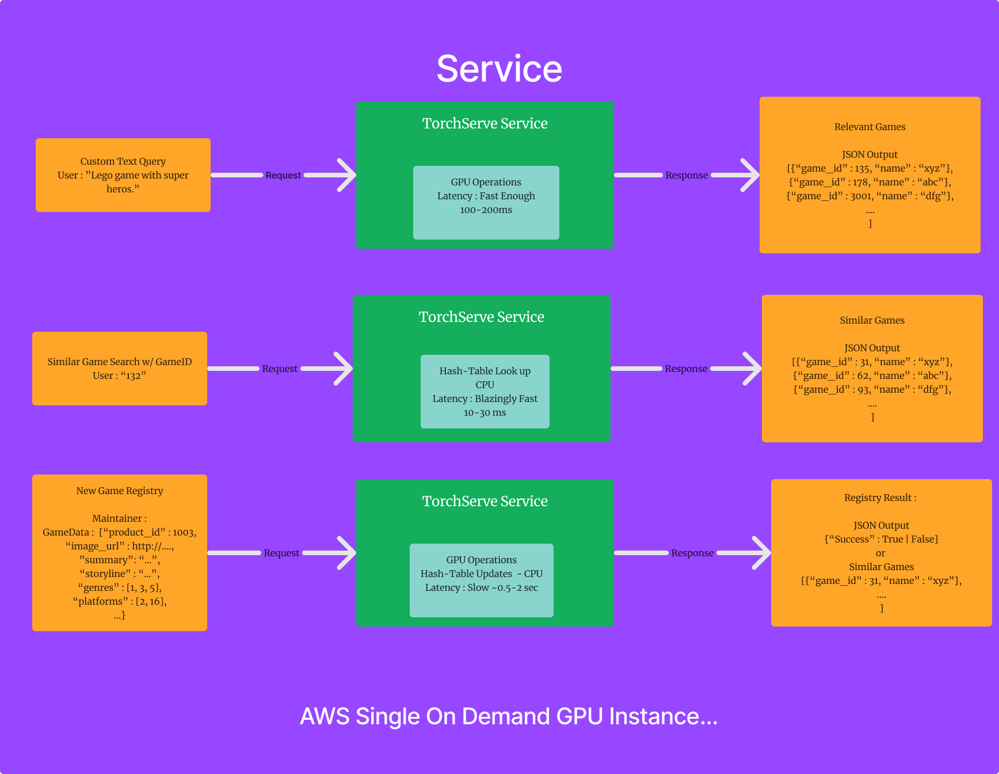

# GameGator Similar Game Search Engine

### Introduction
GameGatorEngine allows you to search for similar games using text, image, and video query.

***Flow Diagram***

***Service Usage Diagram***

##### Preparation of GameGator Dataset

- Download the entire data from [here](https://drive.google.com/drive/folders/18MYu0__EyFmiYb6ZxbmLWq7fA4Rq_5U8)
- Unzip the downloaded data
- Put `cached_data` folder in the root of the project
- Put `custom_configs` folder in the root of this project
- Put `data_new.json` file in the root of this project or generate it using utility script [Check Utility Section].
- Put `gamegator_dataset_28k` folder in the root of this project or generate it using utility
  script [Check Utility Section].
- Put `trained_models` folder in the root of this project.
- You are ready to go!

or you can prepare the data yourself using the utility scripts `prepare_service_data.py`.

`python3 prepare_gg_service_data.py --config_file custom_configs/config_v1.yaml 
--dataset_folder gamegator_dataset_test_28k --model_path trained_models/best.pt`

but this doesn't guarantee that the service will work as expected or the data will be fully ready. For some games, some
of the data might be missing, and you might need to manually add them.

In case of any problem, please contact Redzhep M.R. at Otsala.

### Services

**gamegator-mm-search**
Service for the clip-like multimodel solution.
*Operations* :

- Search with custom Image
- Search with custom Text
- Search similar games with GameID
- Dynamic new game registry (GameData)

**gamegator-ss-search**
Service for the sentence-transformer based solution.
*Operations* :

- Search with custom Text

**gamegator-multi-search** :
Efficient combination of **gamegator-mm-search** and **gamegator-ss-search**.
Uses the strengths of these two services.
*Operations* :

- Search with custom Image
- Search with custom Text
- Search similar games with GameID
- Dynamic new game registry (GameData)